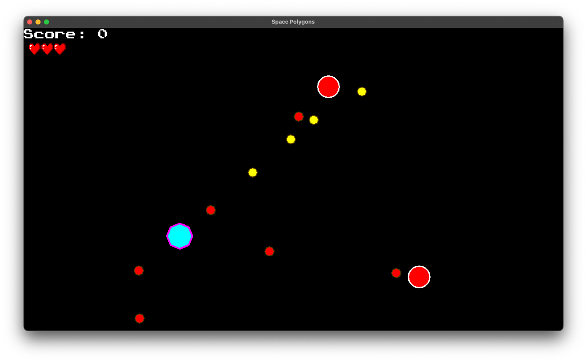
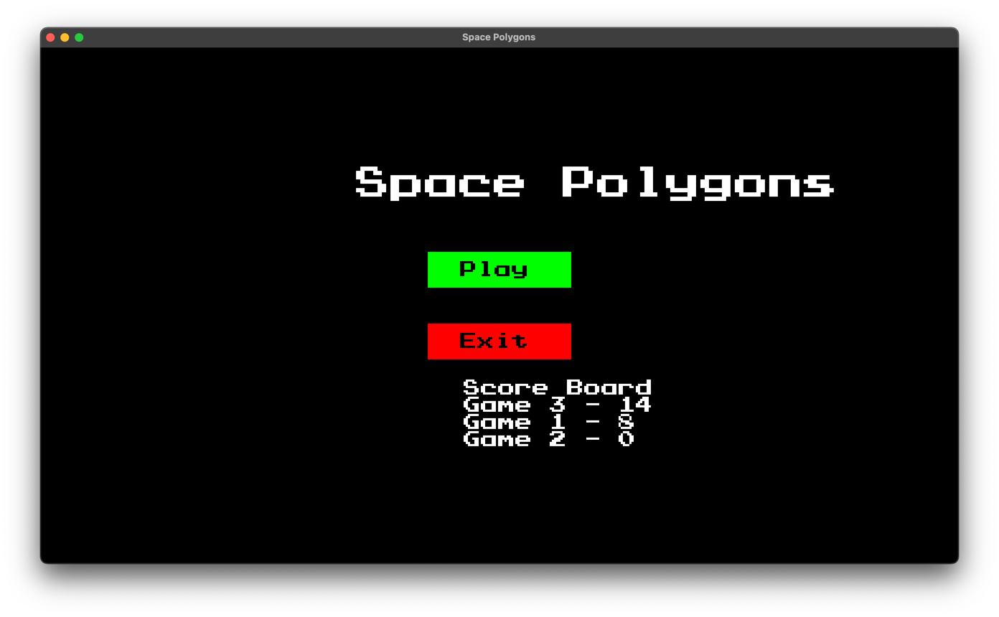

## Showcase

https://github.com/Remake1/Small-2D-Cpp-sfml-game/assets/68705597/c23ca6b0-6fcf-4df2-abcf-8a6522ff21ed

## About
This is a simple 2D game made with SFML. 
The game is 2d space shooter where the player has to shoot the enemies and avoid their bullets.

The game is made using Entity component system (ECS) architecture. There is simple Entity manager.

## Requirements
* g++
* Make
* SFML 2.5.1

## Setup
#### On Linux:
* run `make all`
#### On Windows:
* Download and extract sfml from official website (https://www.sfml-dev.org/download/sfml/2.5.1/) and select GCC MinGW 64-bit version
* Create .env file using .env.example as a template and set the path of the SFML include and lib folder
* run `make all`

*If you have issues with environment variables in makefile, set the SFML_INCLUDE and SFML_LIB variables manually in makefile*

## Note

There is no cmake support. CMakeList.txt is just for old version of JetBrains IDE.
